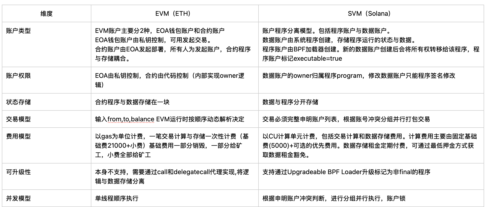
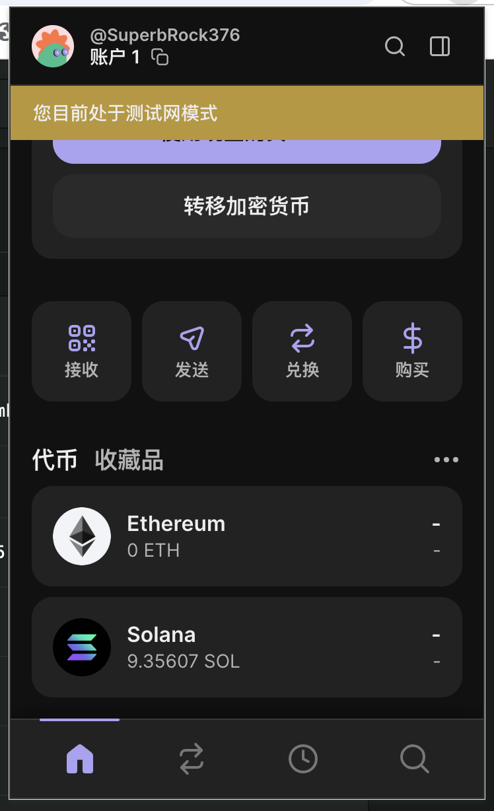
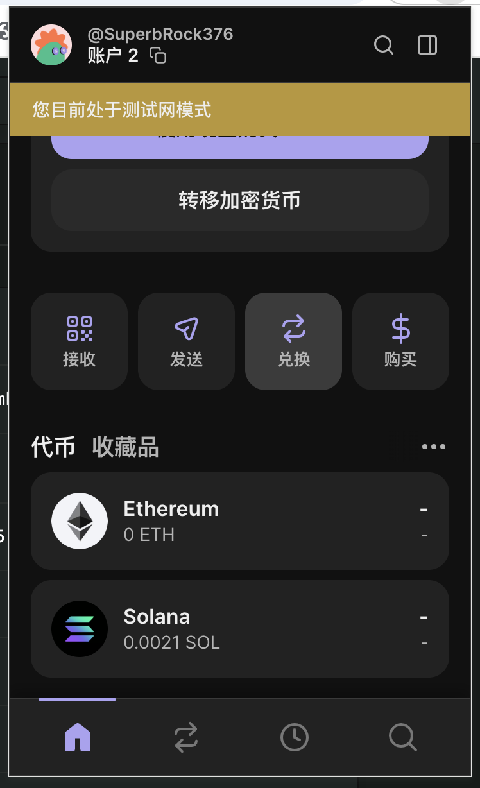

### 一. Solana-go 相关资料

```
官方文档：https://pkg.go.dev/github.com/gagliardetto/solana-go#section-readme

浏览器： https://explorer.solana.com/tx/交易签名?cluster=devnet

anchor 在线编辑：https://beta.solpg.io/

devnet 测试水领取地址：https://faucet.solana.com/

钱包插件：phantom
```

### 二. Solana 交易的基本流程
```
客户端通过RPC
--->创建交易
------>构造交易数据
-------->签名
---------->交易广播
------------>节点预验证（数据正确性）
--------------->领导节点打包交易生成区块
------------------> 其他共识节点验证
--------------------> 上链
-------------------------->交易确认

```

###  三. Solana账户模型

Solana 账户模型有区别于 比特币的UTXO和EVM的账户模型，最简答最明显的一句话概括：程序与存储的数据分离。

##### 1. 基本概念
区别于EVM的EOA和合约账户，Solana中每个账户由以下几个核心属性组成：<br>
1.1 余额  lamports <br>
1.2 字节数据 data <br>
1.3 账户归属应用 owner <br>
1.4 是否为可执行程序 is_executable <br>
1.5 下一个周期租金  rent_epoch <br>
账户可用存放可执行的字节码程序，或状态（程序数据），在solana中数据间距存储需要有一定的租金，否则数据将被清理。

#### 2. 账户归属与交易
2.1 账户的归属与权限中，只有owner（指定的programId）才能写入修改该账户的data数据，也就是说修改数据必须指定owner，读取则不需要。<br>
2.2 发起交易必须声明所有涉及以及访问的数据，由instruction构成。instruction中指明哪些账户读写，哪些要签名等，这与evm区别很大，也正式因为这个机制solana能支持大量并发执行。<br>
2.3 关于数据存储租金，账户数据需要支付一定金额租金才能将数据保存在链上，一般可以通过RPC的【GetMinimumBalanceForRentExemption】获取数据长度所需要支付的最低金额。<br>

#### 3. 交易并行
3.1 solana 在交易提交时需要明确申明涉及账户的读写账户，SVM会把不冲突的交易打包并行执行，从而实现高吞吐。其中修改账户启用排它锁，只读可并行执行，以提高TPS。

#### 4. 与EVM区别


#### 5.SVM交易模型账号申明
首先这里所说的交易需要申明所有账户以及访问状态，是因为账户模型结构（程序与数据分离）要求必须如此。在ETH中一笔交单交易，合约中往往只需要传入 from,to,amount 即可，剩下的（被调用合约，中间跨合约再调用，代币接受者）都是在执行过程中动态解析的。
而SVM需要事先声明，好程序需要知道它读写哪些账号，需要访问哪些数据单元，否则无法进行并行执行。
如测试用例中：[SunTokenSelectot_test.go](sol%2FSunTokenSelectot_test.go) 的CallProgram调用合约需要申明哪些账号，以及对应读写权限。

#### 6. 关于SPL Token代币模型说明
在ETH中（ERC20标准），每个token都是一个独立的合约，用户token数量直接在合约中映射，即用户钱包地址==>token数量，简单明了。

Solana的SPL token模型，程序（合约）不存储数据，讲究每个账户自己持有余额数据。其中涉及几个概念，包括token program，mint account，token address，owner
1. Token program。程序（类似ERC20的合约），管理代币逻辑，如发行和转账等。
2. Mint Account 表示某个代币类型（元数据），存储totalSupply，decimals ，mint_authority(谁能增发)。类似ERC20中的全局变量
3. Token Account 保存某个用户对mint的余额，类似ERC20的balances(address).
4. Owner 这个token account 属于谁（钱包地址）

###  四.Solana-go 合约部署与调用
1. 使用anchor框架快速写以一个sol的合约程序，源码位于 contracts/lib.rs
2. 编写好后，执行build 导出BPF编译的字节码文件 xxx.so 如：bin/SunToken.so
3. 部署，读取字节码，构造交易数据，执行部署交易。代码位于 [SunTokenSelector.go](sol%2FSunTokenSelector.go) （部署真是超级贵啊，一个简单的同质化Token代币合约，部署一次竟然要1.4SOL，WOCAO）
4. 调用合约方法，此处调用方法与EVM类似，构造方法签名，填入参数，签名，发起交易。交易结果可通过区块浏览器查看，如：https://explorer.solana.com/tx/4tPCXU2TRHEZToUqKAdxidkwKxhMkdozCt8gTWZ5N8soypd37xLcerSmk7DQLntmdAEtjC8EGjsFV1eycBu17uw8?cluster=devnet

### 五. Solana-go常规API调用
1. 查询账余额
2. 获取账户信息
3. 查询区块信息
4. 发起交易
5. 查询交易详情

主要代码位于 [SolanaAPI.go](sol%2FSolanaAPI.go)



